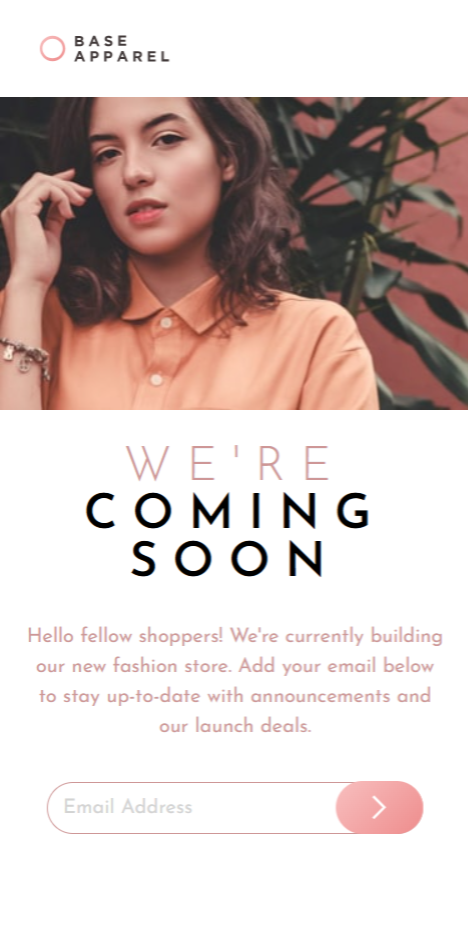

# Frontend Mentor - Base Apparel coming soon page solution

This is a solution to the [Base Apparel coming soon page challenge on Frontend Mentor](https://www.frontendmentor.io/challenges/base-apparel-coming-soon-page-5d46b47f8db8a7063f9331a0).

## Table of contents

-   [Overview](#overview)
    -   [The challenge](#the-challenge)
    -   [Screenshot](#screenshot)
    -   [Links](#links)
-   [My process](#my-process)
    -   [Built with](#built-with)
    -   [What I learned](#what-i-learned)
    -   [Continued development](#continued-development)
    -   [Useful resources](#useful-resources)
-   [Author](#author)
-   [Acknowledgments](#acknowledgments)

## Overview

Creating mobile-first design apparel "Coming soon" page.

### The challenge

Users should be able to:

-   View the optimal layout for the site depending on their device's screen size
-   See hover states for all interactive elements on the page
-   Receive an error message when the `form` is submitted if:
    -   The `input` field is empty
    -   The email address is not formatted correctly

### Screenshot




### Links

-   Solution URL: [Frontend Mentor ](https://www.frontendmentor.io/solutions/base-apparel-coming-soon-page-solution-xIQjrfBS1O)
-   Live Site URL: [Vercel page](https://base-apparel-coming-soon-page-nine-beryl.vercel.app/)

## My process

-   Fist im deconstructing the project in smaller tasks;
-   After analyzing the tasks I'm starting with mobile first layout and build the project from there on;
-   Creating HTML structure with best practices and SEO in mind;
-   Styling with vanilla CSS;
-   Making the page dynamic with JavaScript if needed;
-   Manually tasting nad fixing the wep page, then uploading it;

### Built with

-   Semantic HTML5 markup
-   CSS custom properties
-   Flexbox
-   CSS Grid
-   Mobile-first workflow

### What I learned

In this project for the first time i was using Picture tag and dynamic image change through HTML, also using linear gradient and box-shadow with transition was fun to experiment with.

To see how you can add code snippets, see below:

```html
<picture
    class="hero__image"                                                               
    <source media="(max-width: 760px)" srcset="./images/hero-mobile.jpg" />
    <source media="(min-width: 761px)" srcset="./images/hero-desktop.jpg" />
    
</picture>
```

### Continued development

I’m continuing to build my skills in HTML and CSS and refreshing my JavaScript knowledge. I’m still experiencing some difficulties with certain CSS and HTML tasks, as well as optimization. I also need more practice with creating dynamic layouts for different displays.
I need more time to practice GRID and FLEX too.
After that I'll focus on libraries and frameworks like React and NextJs.

### Useful resources

-   [CSS GRID](https://css-tricks.com/snippets/css/complete-guide-grid/#prop-grid-template) - This helped me for creating the Desktop layout.

-   [Chat GPT](https://chatgpt.com/) - Using Chat GPT for learning more efficient. Mostly for fast suggestions for CSS properties or HTML tags. Thanks to the AI i was able to learn about Picture tag in HTML.

## Author

-   GitHub - [Nikolay Toshev](https://github.com/gilotin)
-   Frontend Mentor - [Nikolay Toshev](https://www.frontendmentor.io/profile/gilotin)
-   LinkedIn - [LinkedIn](https://www.linkedin.com/in/nikolay-toshev-5536a025b/)

## Acknowledgments

I want to thank my friends and family for their support in helping me achieve my dream of becoming a software developer. I also extend my gratitude to all the individuals who contribute online with lessons and projects that enable future developers to learn and grow. Thank you!
